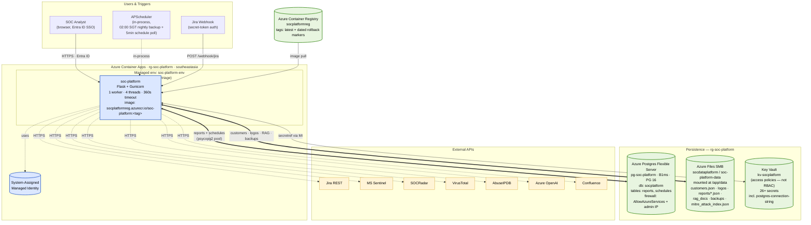
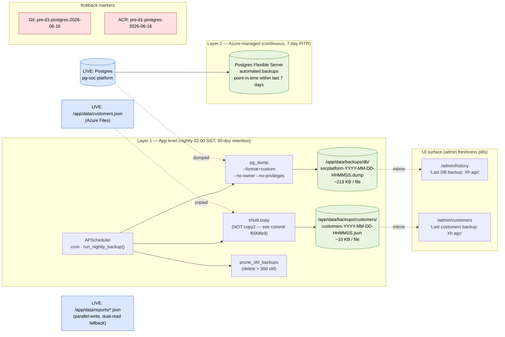
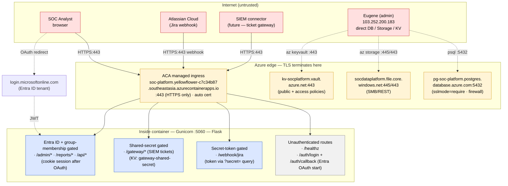
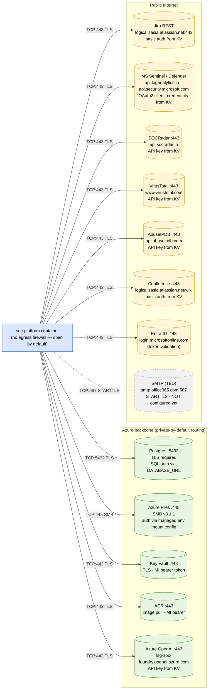

# SOC-Platform Infrastructure

Single-page overview of the live infrastructure that backs the SOC-Platform Flask app: compute, persistence, secrets, backup, rollback, cost.

Last updated: 2026-06-16 (post-D1 migration to Postgres).

## Architecture

## Backup layers

## What's backed up (vs what isn't)

| Data | Live location | Backup | Retention | Notes |
|---|---|---|---|---|
| **reports** table | Postgres `socplatform.reports` | App-level pg_dump → Azure Files **+** Azure PITR **+** dual-read JSON fallback at `data/reports/*.json` | 30d / 7d / forever | Triple-redundant by accident — once 2-week stability window passes (after 2026-06-30), the JSON fallback is removed |
| **schedules** table | Postgres `socplatform.schedules` | App-level pg_dump + Azure PITR | 30d / 7d | RPO = up to 24h via nightly snapshot, or ~5min via PITR |
| **customers.json** | `/app/data/customers.json` (Azure Files) | App-level snapshot + Azure Files inherent redundancy | 30d snapshots; share is LRS-replicated | RPO = 24h via app snapshot; live file itself is highly durable |
| **customer logos** | `/app/data/logos/*` | Azure Files inherent redundancy only | — | Re-uploadable from admin UI if lost |
| **MITRE static index** | `/app/data/mitre_attack_index.json` | Azure Files + ships in container image | — | Re-derivable from MITRE source |
| **RAG vectors** | `/tmp/rag/` (Chroma SQLite) | **NOT backed up — ephemeral by design** | — | Re-synced per-customer via admin UI; SQLite + SMB don't mix |
| **RAG source docs** | `/app/data/rag_docs/` + `customers.json::confluence_pages` | Azure Files inherent | — | Confluence pages re-fetchable on `Sync now` |
| **Job state (jobs dict)** | Gunicorn process memory | Not persisted | — | Container restart = in-flight reports lost. Accepted; single-replica APScheduler constraint |

## Secrets (in `kv-socplatform`, accessed via Managed Identity)

`postgres-connection-string` · `jira-api-token` · `azure-openai-api-key` · `openai-api-key` · `vt-api-key` · `abuseipdb-api-key` · `entra-client-secret` · `flask-secret-key` · `socradar-*-key` (12 SOCRadar variants) · `sentinel-client-secret` · `customer-logicalis-sentinel-client-secret` · `defender-client-secret` · `splunk-token` · `tavily-api-key` · `gateway-shared-secret`

## Rollback paths

| Scenario | Command |
|---|---|
| App regression | `az containerapp update -n soc-platform -g rg-soc-platform --image socplatformreg.azurecr.io/soc-platform:pre-d1-postgres-2026-06-16` |
| Recent DB corruption (≤7d) | Postgres portal → Restore → point-in-time within last 7d |
| DB corruption ≤30d | `pg_restore --clean --if-exists --no-owner --no-privileges -d $DATABASE_URL /app/data/backups/db/<latest>.dump` |
| customers.json corrupted | `cp /app/data/backups/customers/<latest>.json /app/data/customers.json` |
| Catastrophic Postgres loss | Provision new server, restore from latest app-level dump (≤30d) or Azure PITR (≤7d) |

## Rough monthly cost

| Component | ~USD / month |
|---|---|
| Postgres B1ms (compute) | ~17 |
| Postgres storage (32GB Premium SSD v2) | ~4 |
| Container App (1 replica, low traffic) | ~5 |
| Azure Files (LRS, ~2GB used) | ~1 |
| Key Vault (low ops) | ~1 |
| ACR Basic | ~5 |
| **Total** | **~33** |

## Adjacent (out of frame)

- **soc-triage** container app (`rg-soc-triage` / `soctriagereg`) — built as prep work for L1 Triage extraction; shares the managed env, Azure Files share, and KV. Not yet receiving live traffic.
- **Microsoft Sentinel workspaces** (per-customer) — read-only data source, no infra owned by us.

## Operational quick reference

| Action | Where |
|---|---|
| Trigger manual backup | `/admin/history` or `/admin/customers` → "Run backup now" |
| View backup freshness | Pill on `/admin/history` (DB) and `/admin/customers` (customers.json) |
| Configure scheduled reports | `/admin/schedules` (SMTP env vars must be set first) |
| Read live container logs | `az containerapp logs show --name soc-platform --resource-group rg-soc-platform --revision <name> --tail 200 --format text` |
| List backup files on share | `az storage file list --account-name socdataplatform --share-name soc-platform-data --path "backups/db" --account-key $(az storage account keys list --account-name socdataplatform --resource-group rg-soc-platform --query "[0].value" -o tsv)` |
| Manually connect to Postgres | `psql "$(az keyvault secret show --vault-name kv-socplatform --name postgres-connection-string --query value -o tsv)"` (requires your admin IP in the firewall) |

---

# Network

## Public ingress (Internet → SOC-Platform)

## Container egress (SOC-Platform → outside)

## Firewall + access control summary

| Resource | Public network | Allow rules / auth |
|---|---|---|
| **Container App ingress** | Enabled (external) | Anyone can reach the FQDN; auth enforced at app layer (Entra for `/admin/*` + `/reports/*` + `/api/*`; secret-token for `/webhook/jira`; shared-secret for `/gateway/*`) |
| **Postgres** | Enabled with firewall | `AllowAzureServices` (0.0.0.0–0.0.0.0) + `FirewallIPAddress_2026-6-16_9-0-27` (admin IP 103.252.200.183). TLS required (`sslmode=require`). SQL auth only. |
| **Key Vault** | Enabled | **Access policies** (not RBAC). MI of soc-platform container has `get`/`list` on secrets. Admin user (kkchia@lsgazure.com) has full access. |
| **Storage account `socdataplatform`** | Enabled | Account key auth for admin operations. ACA managed env mount uses storage account credentials configured at env level. |
| **ACR `socplatformreg`** | Enabled | Anonymous pull disabled. ACA managed env / container MI pulls via `AcrPull` role assignment. Admin operations via Entra. |
| **Container App egress** | Unrestricted | No NSG, no egress firewall. Container can reach any public endpoint. (Acceptable for current threat model; can tighten with VNet integration later.) |

## DNS / FQDN reference

| Purpose | FQDN | Resolved by |
|---|---|---|
| App | `soc-platform.yellowflower-c7c34b87.southeastasia.azurecontainerapps.io` | Microsoft (auto) |
| Postgres | `pg-soc-platform.postgres.database.azure.com` | Microsoft (auto) |
| Key Vault | `kv-socplatform.vault.azure.net` | Microsoft (auto) |
| Files share | `socdataplatform.file.core.windows.net` | Microsoft (auto) |
| ACR | `socplatformreg.azurecr.io` | Microsoft (auto) |
| Azure OpenAI | `lsg-soc-foundry.openai.azure.com` | Microsoft (auto) |
| Jira / Confluence | `logicalisasia.atlassian.net` | Atlassian |
| SOCRadar | `api.socradar.io` | SOCRadar |
| VirusTotal | `www.virustotal.com` | Google |
| AbuseIPDB | `api.abuseipdb.com` | AbuseIPDB |

No custom domain — using the auto-provisioned `*.azurecontainerapps.io` FQDN. Adding a custom domain would require: CNAME on `logicalis.com`-controlled DNS → ACA domain binding + Microsoft-managed cert (or your own).

## TLS posture

- **Public ingress**: TLS 1.2+ enforced by ACA. Cert auto-provisioned + auto-renewed by Microsoft. Hostname matches the auto FQDN.
- **Postgres**: `sslmode=require` in the connection string — server presents Microsoft-issued cert; client (psycopg2) validates default CA bundle.
- **Egress to all listed APIs**: TLS 1.2+, default Python `httpx` / `requests` validates standard CA bundle. No custom CA pinning in app code.
- **Container internals** (proxy → Gunicorn): plain HTTP on `:5060` — never traverses the public network.
- **SMB to Azure Files**: SMB 3.1.1 with encryption (default since 2019).

## Attack surface summary

| Surface | Auth | Risk | Mitigation today |
|---|---|---|---|
| `/webhook/jira?secret=…` | Query-string secret | Secret leak via logs/referer | Secret stored in KV; webhook is read-only intake; rate-limited by Jira-side |
| `/admin/*`, `/reports/*` | Entra ID + group | Standard SSO | Group membership enforced server-side, not just IdP |
| `/gateway/*` | Shared secret header | Same as webhook | Header-based, less likely to leak than query string |
| Postgres `5432` from Internet | SQL auth + IP firewall | Brute-force on admin user | Strong random password (28 chars), IP whitelist limits to admin + Azure services |
| KV public endpoint | Access policies | MI compromise = secret access | MI scoped to one container; rotate KV secrets if container ever shows signs of compromise |
| ACR public endpoint | MI / Entra | Unauthorized push | Only Eugene + the build pipeline have push perms; pulls are MI-only |

## Notable gaps / future hardening

- **No VNet integration** — container egress is open. A future tightening: put ACA into a VNet, route egress through Azure Firewall, deny everything except whitelisted FQDNs.
- **Postgres has public endpoint** — fine for current threat model but a private endpoint inside a VNet is the next-step posture.
- **No WAF in front of ingress** — direct ACA ingress. Add Azure Front Door + WAF if exposed to direct attack.
- **No mTLS / cert-bound auth** for webhooks — token-only.
- **Custom domain + DMARC/SPF** for sending — applies once SMTP is configured.
