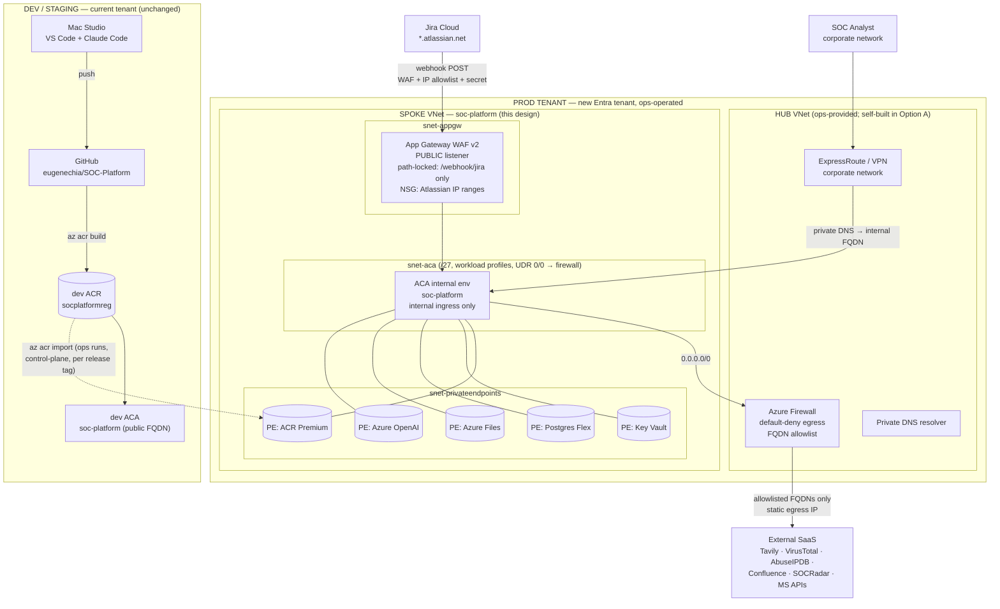

# SOC-Platform — Production Private-Tenant Architecture

Design for promoting SOC-Platform into a locked-down production Azure tenant:
no public exposure of the app or its data plane, all Azure-to-Azure traffic on
private endpoints, and outbound internet restricted to a named, logged FQDN
allowlist.

Approved 2026-07-17. Pairs with:
- [INFRASTRUCTURE.md](INFRASTRUCTURE.md) — the current (now **dev/staging**) stack
- [DUPLICATE-TO-NEW-SUBSCRIPTION.md](DUPLICATE-TO-NEW-SUBSCRIPTION.md) — the
  resource-by-resource build runbook this design layers networking on top of
- [architecture/](architecture/) — rendered diagrams (`04_prod_private.png` is
  this design)

---

## Decisions locked

| # | Decision | Choice |
|---|---|---|
| 1 | Egress policy | **Controlled egress**: default-deny outbound via Azure Firewall; explicit FQDN allowlist for the external SaaS the app needs (Tavily, VirusTotal, AbuseIPDB, Jira/Confluence Cloud, SOCRadar, Microsoft identity/API planes). Zero-egress was rejected — it would disable IOC insights, enrichment, Confluence RAG sync and webhook triage. |
| 2 | Tenant & operations | **New Entra tenant; ops team deploys.** Eugene has no standing access to prod. Everything crossing the boundary is an artifact: immutable image tag, IaC, runbook, secret-name list. |
| 3 | Inbound | **Analysts private, Jira stays Atlassian Cloud.** Analysts reach the app over the corporate network. One controlled public door exists solely for Jira Cloud webhooks (App Gateway WAF, path-locked). |
| 4 | Topology | **Hub-spoke (Option B) primary**: the spoke (app + private endpoints + App Gateway) is fully specified here and plugs into the ops team's existing hub (firewall, ExpressRoute/VPN, DNS). **Option A fallback**: if no hub exists, the same spoke gets its own Azure Firewall and VPN gateway — nothing else changes. |

The dev/test tenant keeps running exactly as today and is formally re-badged
**dev/staging**. Prod is *promote-only*: no `az` CLI, no VS Code, no Docker
pointed at it from the dev side.

---

## Topology

---

## Spoke VNet layout

One VNet (suggested `vnet-soc-platform-prod`, e.g. `10.x.0.0/24`), three
subnets:

| Subnet | Size | Purpose | Notes |
|---|---|---|---|
| `snet-aca` | /27 minimum | ACA managed environment (**workload profiles**) | Delegated to `Microsoft.App/environments`. Workload-profiles mode is **required** — consumption-only environments do not honour UDRs, and the default route to the firewall is the whole point. |
| `snet-privateendpoints` | /28 | All five private endpoints | No delegation. |
| `snet-appgw` | /28 | Application Gateway WAF v2 | NSG restricting inbound 443 to Atlassian's published IP ranges. |

**Route table on `snet-aca`:** `0.0.0.0/0 → next hop: Azure Firewall private
IP` (hub firewall in Option B; spoke-local in Option A). Nothing in the app
subnet can reach the internet except through the firewall.

**Peering (Option B):** spoke ↔ hub, with the spoke using the hub's DNS
resolver and the hub advertising the spoke to ExpressRoute/VPN clients.

## Private endpoints and DNS zones

All five data-plane dependencies get `publicNetworkAccess: Disabled` plus a
private endpoint in `snet-privateendpoints`:

| Resource | SKU change vs dev | Private DNS zone |
|---|---|---|
| ACR | Basic → **Premium** (only tier with PE support) | `privatelink.azurecr.io` |
| Key Vault | none | `privatelink.vaultcore.azure.net` |
| Postgres Flexible Server | none (B1ms fine) | `privatelink.postgres.database.azure.com` |
| Storage (Azure Files) | none | `privatelink.file.core.windows.net` |
| Azure OpenAI | new resource in prod tenant | `privatelink.openai.azure.com` |

Zones are linked to the spoke (and hub, so analysts/ops resolve them). The
app's env-var contract is unchanged — the same hostnames now resolve to
private IPs. Azure OpenAI traffic therefore never touches the firewall.

Log Analytics stays as-is initially; move it behind AMPLS later if ops
requires it (additive, no app change).

## Inbound — two doors

**Door 1: Jira Cloud webhooks (public, heavily constrained).**
Application Gateway WAF v2 with a public frontend:
- Path rule: `POST /webhook/jira*` → backend = ACA internal FQDN. **Every
  other path returns 403.** Admin UI, dashboards, `/triage` are unreachable
  from the internet.
- NSG on `snet-appgw`: inbound 443 only from Atlassian's published egress IP
  ranges (JSON feed; ops refreshes on a schedule).
- Existing `JIRA_WEBHOOK_SECRET` token still enforced by the app — third layer.
- Health probe: `/healthz`.

**Door 2: analysts (fully private).**
Analysts on the corporate network (via the hub's ExpressRoute/VPN) resolve the
ACA environment's internal FQDN through the linked private DNS zone and hit
the internal ingress directly. Entra SSO is unaffected: the browser talks to
`login.microsoftonline.com` itself, so SSO needs no inbound path to the app.
`ENTRA_REDIRECT_URI` is set to the analyst-facing hostname (internal FQDN, or
a custom domain if ops prefers — cosmetic, decide at build time).

Note the app ends up with two hostnames: the App Gateway public one (webhook
registration in Jira) and the internal one (analysts + Entra redirect). No
code change — both are just URLs in config.

## Egress — default-deny + FQDN allowlist

Azure Firewall application rules (TLS/SNI-based FQDN filtering, no TLS
interception), all 443 unless noted:

| Destination FQDN | Used by | Notes |
|---|---|---|
| `api.tavily.com` | IOC web-research insights | Payload already minimised by the Tavily privacy sanitizer (shipped 2026-07-08) |
| `www.virustotal.com` | hash/IP/domain enrichment | |
| `api.abuseipdb.com` | IP enrichment | |
| `<org>.atlassian.net`, `api.atlassian.com` | Jira REST + Confluence RAG sync | |
| `platform.socradar.com`, `mcp.socradar.com` | SOCRadar REST + MCP | only if SOCRadar is wired in prod |
| `login.microsoftonline.com` | Entra tokens (MSAL, Sentinel/Defender SPs) | |
| `graph.microsoft.com` | Entra group check | |
| `api.loganalytics.io` | cross-tenant Sentinel KQL | customer workspaces live in other tenants → public Microsoft API plane; normal and unavoidable |
| `management.azure.com` | Sentinel/ARM lookups | |
| `api.securitycenter.microsoft.com` | Defender advanced hunting | if Defender customers onboarded |
| `mcr.microsoft.com`, `*.data.mcr.microsoft.com` | ACA platform images | required by Container Apps itself |
| SMTP relay host, TCP 587 | scheduled report email | network rule, not application rule |

Everything else: **deny + log** (firewall logs → ops Log Analytics). Splunk
on-prem (`10.11.1.181`) is private routing via the hub, not internet egress.

The firewall's public IP is the app's **static egress IP** — hand it to any
SaaS vendor that supports source-IP allowlisting (SOCRadar, VT enterprise).

"No data leaks" therefore operationalises as: *data leaves only to named,
business-justified, logged destinations; nothing else can connect out.*

## Identity and secrets

- System-assigned managed identity, exactly as dev: `AcrPull` on prod ACR,
  get/list on prod Key Vault.
- Fresh Entra app registration in the prod tenant (the "different tenant" path
  of DUPLICATE-TO-NEW-SUBSCRIPTION.md Decision A): new client ID, new allowed
  admins group, redirect URI = analyst-facing hostname.
- **Ops populates every Key Vault secret.** Eugene supplies the secret *name*
  list (INFRASTRUCTURE.md → Secrets, 26+ names) and which third parties need
  fresh prod keys. Prod secret values never exist on the dev side.
- `JIRA_ENRICHMENT_PROJECT` allowlist in prod must not overlap dev's
  (`SCDM,LOGICALIS`) — the double-triage trap from the duplicate runbook
  applies in full.

## Promotion workflow (dev → prod)

Daily development is untouched: Mac Studio → GitHub → `az acr build` into dev
ACR → dev ACA → probe tickets. Promotion is a release event:

1. **Cut a release** (Eugene): merge to `main`, tag `vX.Y.Z`, build
   `soc-platform:vX.Y.Z` in dev ACR, record the image **digest** in release
   notes along with env-var deltas and new secret names since last release.
2. **Hand off**: release notes + Bicep/parameters + runbook. A scoped,
   short-lived pull token on dev ACR lets ops fetch the image.
3. **Import** (ops): `az acr import --source
   socplatformreg.azurecr.io/soc-platform:vX.Y.Z` into prod ACR. This is a
   control-plane operation — it works against a network-restricted target
   registry, no tarball shuffling, and the tag is immutable once imported.
4. **Deploy** (ops): apply Bicep deltas, `az containerapp update` to the new
   tag, then smoke-test `/healthz` and one probe ticket from inside the
   network.
5. **Rollback** = `az containerapp update` back to the previous immutable tag
   — same discipline as the dev tenant's dated rollback tags today.

When cadence justifies it, steps 3–4 become a GitHub Actions workflow using
OIDC federation into the prod tenant with a GitHub-environment approval gate
**owned by ops** — the runbook is the contract either way.

## Deltas, costs, lead times

| Item | Impact |
|---|---|
| Azure OpenAI quota in the new tenant | **Critical-path long-lead item** (days). Submit first, before any infra. |
| ACR Premium | ~US$50/mo (vs $5 Basic) — required for private endpoints |
| App Gateway WAF v2 | ~US$250–330/mo |
| Azure Firewall Basic | ~US$300/mo — **Option A only**; Option B uses the hub's |
| VPN Gateway | Option A only, if no ExpressRoute (~US$30–140/mo by SKU) |
| Private endpoints + DNS zones | ~US$40/mo (5 PEs + zones) |
| Base stack (ACA, Postgres B1ms, Files, KV, LAW) | ~US$35/mo, as dev |
| **Ballpark total** | **Option B ≈ US$350–450/mo · Option A ≈ US$650–750/mo** (vs ~$33 dev). Reconcile with `azure-migration-cost-estimate-2026-07-15.xlsx`. |

Other constraints carried forward from the duplicate runbook: fresh
`flask-secret-key`/`gateway-shared-secret`/`JIRA_WEBHOOK_SECRET`; empty DB
(schema self-creates); seed empty `customers.json`; Chroma stays ephemeral in
`/tmp/rag` (unchanged — RAG re-syncs per customer via admin UI).

## What ops must confirm before build

1. Hub capabilities: firewall (with FQDN application rules), ExpressRoute/VPN
   reach for analysts, private DNS resolver, spoke address-space assignment.
2. Whether they want a custom domain for the analyst-facing hostname.
3. Process for refreshing the Atlassian IP allowlist on the App Gateway NSG.
4. Azure OpenAI quota request submitted (embeddings + chat models).
5. Who owns the GitHub-environment approval if/when the pipeline is automated.
