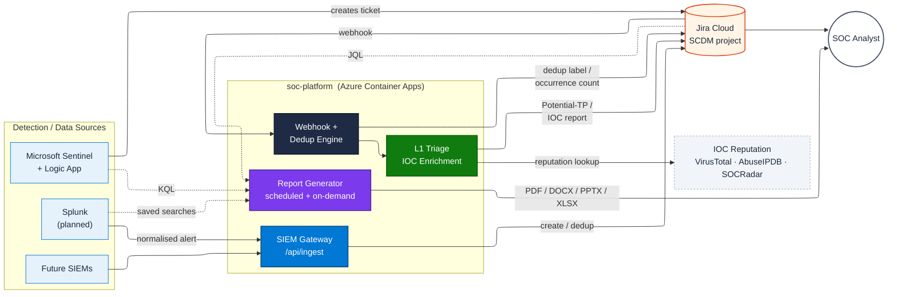
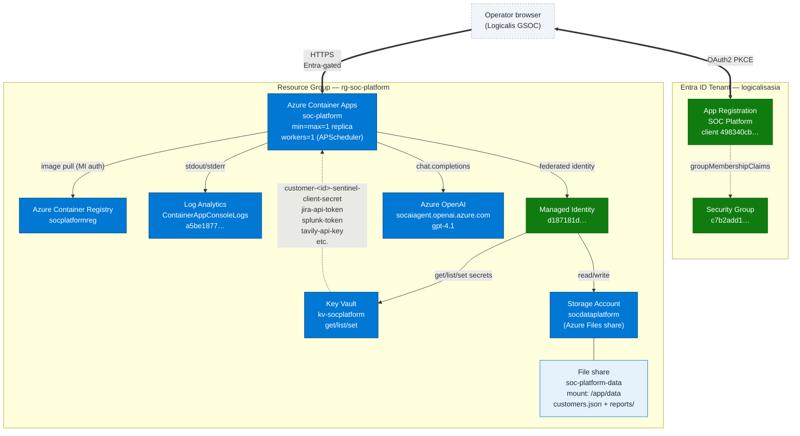
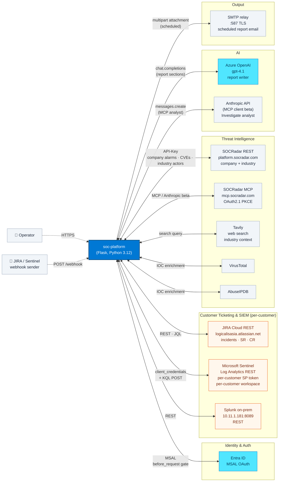
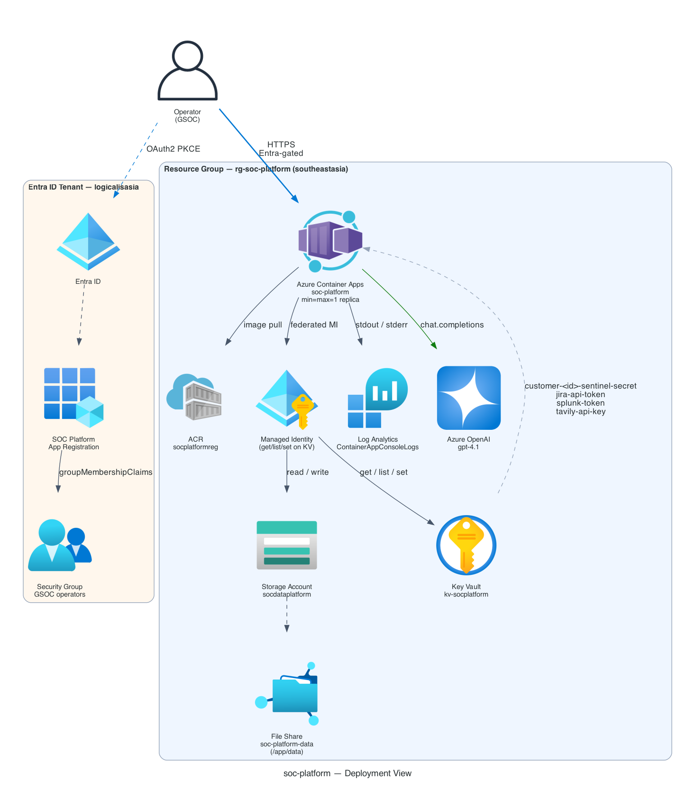
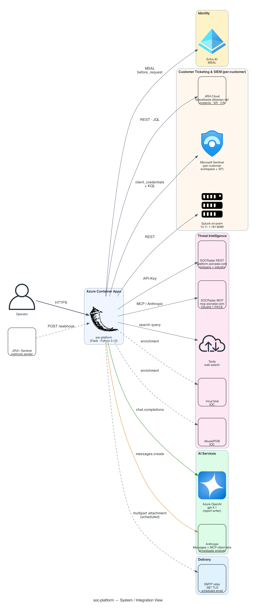
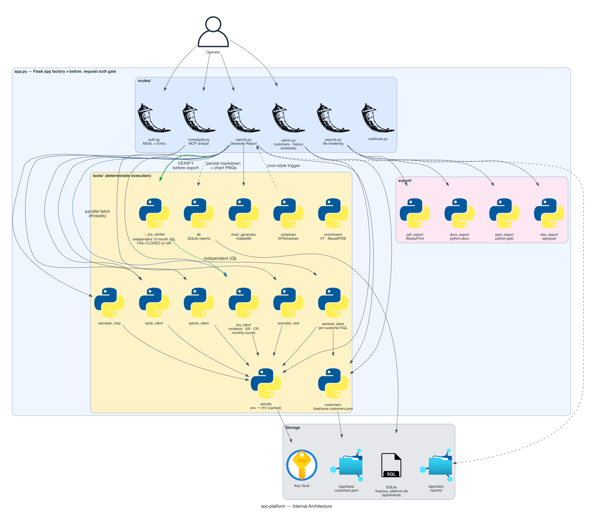

# soc-platform — Architecture

The merged Logicalis GSOC platform combines two operator surfaces on one Azure deployment: the **Generate Report** workflow (calendar-driven, structured, multi-source) and the **Investigate** workflow (free-form AI analyst). This document presents four views of the same system at different zoom levels.

The Mermaid diagrams below render natively in GitHub, GitLab, VS Code (with Mermaid extension), Confluence, and most modern markdown viewers. PNG renders of all panels live alongside this file.

---

## Panel 0 — General overview

soc-platform has two operator-facing surfaces wired to the same set of upstream data sources:

- **Detection-and-triage pipeline** — Sentinel (with its existing Logic App) creates Jira tickets directly; future SIEMs (Splunk first) route through `/api/ingest` for pre-creation deduplication. Every ticket fires the webhook handler, which deduplicates strict matches and runs L1 IOC triage. Triaged tickets land in the SOC analyst's Jira queue with a `Potential-TP` label if malicious.
- **SOC Report Generator** — calendar-driven and on-demand. Pulls structured data from Jira (incident counts/JQL), Sentinel (KQL via per-customer SP credentials), and Splunk (saved searches, planned), and produces PDF / DOCX / PPTX / XLSX deliverables for analyst review or scheduled customer email.



**Key facts**
- Two dedup checkpoints share one hash function: gateway dedupes BEFORE creation (Splunk-style); webhook dedupes AFTER creation (Sentinel-style). Equivalent inputs always produce equivalent keys regardless of path.
- Strict-match definition for the webhook path: same dedup key + same summary + same five typed entity fields + old ticket created within the last 24h. Looser matches are treated as separate recurrences.
- Duplicate tickets are FLAGGED (`Duplicate` label) and kept Open — analysts manually review and close.
- L1 Triage runs on every ticket regardless of dedup outcome, so each ticket carries its own IOC enrichment + Potential-TP label (if malicious).
- Report Generator and triage pipeline coexist on the same Container App single replica. Each customer's Sentinel workspace is queried via that customer's own Service Principal credentials, stored per-customer in Key Vault.

PNG render: [`00_overview.png`](00_overview.png). Mermaid source: [`00_overview.mmd`](00_overview.mmd).

---

## Panel 1 — Deployment view

What lives in Azure and how the pieces are wired. Resource group `rg-soc-platform` in **southeastasia**.



**Key facts**
- Single replica enforced (`min_replicas == max_replicas == 1`) — APScheduler requires it, otherwise scheduled-report jobs would multi-fire.
- Customers are persisted as a flat JSON file on the mounted Azure Files share — not a database. SQLite (`/tmp/soc_platform.db`) holds generated report metadata only and is **ephemeral** (rebuilt from the share on revision rollover).
- Per-customer Sentinel SP secrets live in Key Vault under deterministic name `customer-<id>-sentinel-client-secret`. Customer record stores the KV reference, never the secret value.
- ACA runs Gunicorn with `--workers 1 --threads 4` on port 5060.

---

## Panel 2 — System / integration view

Every external service the running app talks to, and the direction of data flow. Boxes outside the dashed border are **third-party** systems that Logicalis does not own.



**Mode-specific call patterns**

| Operator mode | LLM | Threat-intel sources | Output |
|---|---|---|---|
| **Generate Report** | Azure OpenAI gpt-4.1 (parallel per source group) | SOCRadar REST + Tavily (industry section) | Markdown → PDF / DOCX / PPTX / XLSX |
| **Investigate** | Anthropic + MCP-client beta | SOCRadar MCP (full tool catalog) + Tavily | Streaming Markdown in-browser |

**Per-customer credentials** (each onboarded customer brings their own):
- `sentinel_tenant_id` / `sentinel_client_id` / `sentinel_workspace_id` — stored on customer record
- `sentinel_client_secret` — written to KV under `customer-<id>-sentinel-client-secret`, never persisted in JSON
- `jira_project_key`, `jira_request_type`, `jira_incident_issuetype`, `jira_service_request_issuetype`, `jira_change_request_issuetype` — all on the customer record

---

## Panel 3 — Internal architecture

Inside the Flask app: blueprints, tools, exporters, and how the report-generation data path wires them together. Solid arrows = synchronous call; dashed = background task / scheduled.

```mermaid
flowchart TB
    classDef route   fill:#DBEAFE,stroke:#2563EB,color:#1E3A8A,stroke-width:1px
    classDef tool    fill:#FEF3C7,stroke:#D97706,color:#78350F,stroke-width:1px
    classDef exporter fill:#FCE7F3,stroke:#BE185D,color:#831843,stroke-width:1px
    classDef store   fill:#E5E7EB,stroke:#374151,color:#1F2937,stroke-width:1px
    classDef ext     fill:#F1F5F9,stroke:#94A3B8,color:#1E293B,stroke-width:1px,stroke-dasharray:3 3
    classDef verify  fill:#DCFCE7,stroke:#16A34A,color:#14532D,stroke-width:2px

    OP["👤 Operator (browser)"]:::ext

    subgraph FLASK ["app.py — Flask app factory + before_request auth gate"]
        direction TB

        subgraph ROUTES ["routes/"]
            R_AUTH["auth.py<br/>MSAL + Entra"]:::route
            R_REP["reports.py<br/>wizard + /api/generate"]:::route
            R_INV["investigate.py<br/>SOCRadar MCP analyst"]:::route
            R_ADM["admin.py<br/>customers · history · schedules"]:::route
            R_EXP["exports.py<br/>PDF/DOCX/PPTX/XLSX"]:::route
            R_WH["webhook.py"]:::route
        end

        subgraph TOOLS ["tools/"]
            direction TB
            T_JIRA["jira_client<br/>incidents · SR · CR<br/>monthly counts"]:::tool
            T_VER["jira_verifier<br/>independent 12-month JQL<br/>FAIL-CLOSED on diff"]:::verify
            T_SENT["sentinel_client<br/>per-customer KQL"]:::tool
            T_SPLK["splunk_client"]:::tool
            T_SOCR["socradar_rest"]:::tool
            T_SOCM["socradar_mcp"]:::tool
            T_TAV["tavily_client"]:::tool
            T_CUST["customers<br/>load/save customers.json"]:::tool
            T_SEC["secrets<br/>env → KV fallback<br/>cached"]:::tool
            T_DB["db<br/>SQLite reports"]:::tool
            T_SCH["scheduler<br/>APScheduler"]:::tool
            T_CHRT["chart_generator<br/>matplotlib"]:::tool
            T_ENR["enrichment<br/>VT · AbuseIPDB"]:::tool
        end

        subgraph EXPORT ["export/"]
            E_PDF["pdf_export<br/>WeasyPrint"]:::exporter
            E_DOCX["docx_export<br/>python-docx"]:::exporter
            E_PPTX["pptx_export<br/>python-pptx"]:::exporter
            E_XLSX["xlsx_export<br/>openpyxl"]:::exporter
        end
    end

    subgraph PERSIST ["Storage"]
        FS_CUST["(/app/data/customers.json<br/>Azure Files)"]:::store
        FS_REP["(/app/data/reports/<br/>Azure Files)"]:::store
        SQLITE["(/tmp/soc_platform.db<br/>SQLite — ephemeral)"]:::store
        KV["(Key Vault<br/>per-customer SP secrets<br/>API keys)"]:::store
    end

    OP --> R_AUTH
    OP --> R_REP
    OP --> R_INV
    OP --> R_ADM

    R_REP -->|"_collect_report_data<br/>(parallel threads)"| T_JIRA
    R_REP --> T_SENT
    R_REP --> T_SPLK
    R_REP --> T_SOCR
    R_REP --> T_TAV
    R_REP -->|"after fetch:<br/>verify_monthly_counts"| T_VER
    R_REP --> T_CHRT
    R_REP --> T_CUST

    R_INV --> T_SOCM
    R_INV --> T_TAV

    R_ADM --> T_CUST
    R_ADM --> T_SEC

    R_EXP --> E_PDF
    R_EXP --> E_DOCX
    R_EXP --> E_PPTX
    R_EXP --> E_XLSX

    T_SCH -..->|"cron-style trigger"| R_REP

    T_VER -->|"independent JQL"| T_JIRA
    T_JIRA --> T_SEC
    T_SENT --> T_SEC
    T_SENT --> T_CUST
    T_SPLK --> T_SEC
    T_SOCR --> T_SEC
    T_SOCM --> T_SEC
    T_TAV --> T_SEC
    T_CUST --> FS_CUST
    T_DB --> SQLITE
    T_SEC --> KV

    R_REP -->|"persist report markdown<br/>+ chart PNGs"| T_DB
    R_REP --> FS_REP
```



**Critical data path: report generation** (chronological, single job)

1. `POST /reports/api/generate` → background thread with config dict.
2. `_collect_report_data` resolves the customer record once via `get_customer()`, then fans out **parallel** fetches:
   - `fetch_incidents_for_report` (in-period, day-chunked, full pagination)
   - `fetch_monthly_counts_12m` (per-month, 12 separate JQL queries)
   - `fetch_service_requests` / `fetch_change_requests` (gated on customer's per-customer issue-type override)
   - `sentinel_client.fetch_data` (per-customer SP token via KV)
   - `splunk_client.fetch_data`, `socradar_rest.fetch_data`
   - Industry intel: `tavily_client.fetch_industry_threat_intel` + `socradar_rest.fetch_industry_data`
3. **Verifier gate**: `jira_verifier.verify_monthly_counts` runs an independent 12-month JQL window with cursor pagination and locally groups by `created` month. If primary and verifier disagree on any month, the report **raises** before exports are produced.
4. Charts (matplotlib) render PNGs of the 12-month bar, severity breakdown, status pie, etc.
5. Per-source LLM calls run **in parallel** (one Azure OpenAI request per source group) writing markdown sections.
6. Sections assembled in fixed group order (jira → sentinel → splunk → socradar → general), with `_REPORT_TAIL` boilerplate appended.
7. Persisted to SQLite metadata + JSON-on-Azure-Files for re-export and history.
8. Operator-triggered exports (PDF/DOCX/PPTX/XLSX) consume the persisted markdown — never re-fetch source data.

---

## How to render

**Mermaid panels (this file):**
- View on GitHub directly — the diagrams render inline.
- VS Code: install the *Markdown Preview Mermaid Support* extension, then open this file with Cmd+Shift+V.
- Confluence: paste the fenced ` ```mermaid ` blocks into a Mermaid macro.

**PNG renders (for slides / executive decks):**
```bash
# from project root
.venv-diagrams/bin/python docs/architecture/render_architecture.py
# produces 01_deployment.png, 02_integration.png, 03_internal.png in docs/architecture/
```

The three rendered PNGs:
- 
- 
- 

The PNG generator uses the `mingrammer/diagrams` library with proper Azure-branded service icons. Re-run after any architectural change to keep slides in sync.
